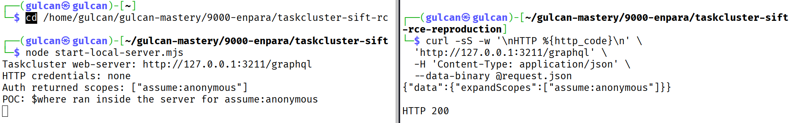

# An HTTP request makes Taskcluster run a `$where` string through `sift@17.1.3`



## What this test proves

An [HTTP POST](https://www.apollographql.com/docs/apollo-server/workflow/requests#post-requests) is a web request that carries data in its body. This request did not include an [`Authorization` header](https://developer.mozilla.org/en-US/docs/Web/HTTP/Reference/Headers/Authorization), the part of a web request that normally carries login credentials.

The body asked the old Taskcluster `/graphql` address to run `expandScopes`. [GraphQL](https://graphql.org/learn/) is a language that lets one program name the data or action it wants from another program. Taskcluster's [GraphQL schema](https://graphql.org/learn/schema/) listed `expandScopes` as an allowed query, and its [`Scopes` resolver](https://www.graphql-js.org/docs/resolver-anatomy/) was the function that received the query's `scopes` and `filter` values. Here, `filter` contains the rules for deciding which returned permissions to keep. The resolver handed both values to Taskcluster's [scope loader](https://github.com/taskcluster/taskcluster/blob/f48168b7c3a8a8f78c4463cde98c1218a9edc6c6/services/web-server/src/loaders/scopes.js#L18-L30), which asks Auth for the permissions and then gives the permissions and filter to [`sift`](https://github.com/crcn/sift.js/tree/v17.1.3), a package that checks JavaScript values against those rules.

The filter contained [`$where`](https://github.com/crcn/sift.js/blob/v17.1.3/src/operations.ts#L385-L402), a `sift` option that tests each value with a supplied condition. In `sift@17.1.3`, `$where` could receive text and read that text as JavaScript code. The code used here only printed one line in the local server terminal and returned `true`. It did not start another program, read a file, inspect a saved password or token, or connect to another computer.

Taskcluster's [Auth service](https://github.com/taskcluster/taskcluster/blob/f48168b7c3a8a8f78c4463cde98c1218a9edc6c6/services/auth/README.md#L1-L3) is the separate program that manages Taskcluster permissions and credentials. This test replaces the outgoing Auth request with a local function that returns the same permission list. Taskcluster still reads the HTTP body, finds `expandScopes`, calls `Scopes.js` and `loaders/scopes.js`, and reaches `sift` after that local function returns. The test does not independently check which permissions a real running Auth service gives an anonymous caller.

## Target and test details

- Source code: `taskcluster/taskcluster`
- [Commit](https://git-scm.com/docs/gitglossary#Documentation/gitglossary.txt-aiddefcommitacommit), Git's name for a saved version of the files: `f48168b7c3a8a8f78c4463cde98c1218a9edc6c6`
- Local address: `http://127.0.0.1:3211/graphql`
- GraphQL query: `expandScopes`
- Installed `sift` version: `17.1.3`
- [Node.js](https://nodejs.org/en/learn/getting-started/introduction-to-nodejs), the program that runs Taskcluster's JavaScript on the server, requested version: `24.15.0`
- Node.js version used for this local run: `24.19.0`
- Test time: `2026-09-25 11:19:41 UTC`
- Credentials: none; the request contained no `Authorization` header

The local start script asks Taskcluster's [`main.js` to create its web server](https://github.com/taskcluster/taskcluster/blob/f48168b7c3a8a8f78c4463cde98c1218a9edc6c6/services/web-server/src/main.js#L166-L195). The request then passes through the real [`/graphql` POST route and the code that reads its credentials](https://github.com/taskcluster/taskcluster/blob/f48168b7c3a8a8f78c4463cde98c1218a9edc6c6/services/web-server/src/servers/createApp.js#L82-L91). This query never reads Taskcluster's database or message service, and the start script gives the server empty JavaScript objects for them instead of connecting to other programs.

## Check the affected version

Open the affected commit and install the exact package versions recorded by Taskcluster:

```bash
cd /path/to/taskcluster
git switch --detach f48168b7c3a8a8f78c4463cde98c1218a9edc6c6
corepack yarn install --immutable
```

The following commands confirmed the commit, Node.js version, installed `sift` version, and the value of `CSP_ENABLED` in the local checkout:

```bash
git rev-parse HEAD
node -p '[process.version, require("./node_modules/sift/package.json").version, String(process.env.CSP_ENABLED)].join("\n")'
```

```text
f48168b7c3a8a8f78c4463cde98c1218a9edc6c6
v24.19.0
17.1.3
undefined
```

`undefined` means `CSP_ENABLED` was not set.

[Content Security Policy (CSP)](https://developer.mozilla.org/en-US/docs/Web/HTTP/Guides/CSP#eval_and_similar_apis) is a set of restrictions that can stop JavaScript from creating code from a string. The [`$where` code in `sift@17.1.3`](https://github.com/crcn/sift.js/blob/v17.1.3/src/operations.ts#L385-L402) reads the `CSP_ENABLED` setting before it handles the supplied value:

```javascript
export const $where = (
  params: string | Function,
  ownerQuery: Query<any>,
  options: Options,
) => {
  let test;
  if (isFunction(params)) {
    test = params;
  } else if (!process.env.CSP_ENABLED) {
    test = new Function("obj", "return " + params);
  } else {
    throw new Error(
      `In CSP mode, sift does not support strings in "$where" condition`,
    );
  }

  return new EqualsOperation((b) => test.bind(b)(b), ownerQuery, options);
};
```

When `CSP_ENABLED` is missing or empty and `$where` contains a string, line 394 passes that string to `new Function()`, which makes Node.js read it as JavaScript code. Line 401 runs that code against each value that `sift` checks. When `CSP_ENABLED` contains any non-empty value, `sift` throws an error before calling `new Function()`.

## Start the local web-server

From this PoC folder, start the server in the first terminal:

```bash
node start-local-server.mjs
```

The script checks that the Taskcluster checkout has `sift@17.1.3`, loads the old `services/web-server/src/main.js`, and listens only on `127.0.0.1`, an address that accepts connections from the same computer:

```text
Taskcluster web-server: http://127.0.0.1:3211/graphql
```


## Send the HTTP request

Taskcluster calls each permission name a [`scope`](https://github.com/taskcluster/taskcluster/blob/f48168b7c3a8a8f78c4463cde98c1218a9edc6c6/dev-docs/best-practices/scopes.md), and the request uses one permission named `assume:anonymous`. Its `$where` string asks the server to print that permission and then returns `true`, which tells `sift` to keep it in the GraphQL result.

The request is stored in [`request.json`](./request.json). Send it from a second terminal with [`curl`](https://curl.se/docs/manpage.html), a command that sends web requests, and leave out the `Authorization` header:

```bash
curl -sS -w '\nHTTP %{http_code}\n' \
  'http://127.0.0.1:3211/graphql' \
  -H 'Content-Type: application/json' \
  --data-binary @request.json
```

The second terminal received this response:

```text
{"data":{"expandScopes":["assume:anonymous"]}}

HTTP 200
```

The GraphQL response contains `assume:anonymous` because the code inside `$where` returned `true`. [`HTTP 200`](https://developer.mozilla.org/en-US/docs/Web/HTTP/Reference/Status/200) means the server accepted and handled the request, but that response alone does not show that the JavaScript ran, which is why the server terminal is the important part of this test.

## What the server printed

The first terminal printed these three lines after the HTTP request arrived:

```text
HTTP credentials: none
Auth returned scopes: ["assume:anonymous"]
POC: $where ran inside the server for assume:anonymous
```

`HTTP credentials: none` confirms that the Taskcluster code reading the request did not find an `Authorization` header. `Auth returned scopes` records the local Auth replacement returning the one permission supplied by the request. The final line comes from the JavaScript string inside `$where`. That line appeared in the server terminal because `sift` passed the string to `new Function()` and ran it for `assume:anonymous`.

The observed sequence was:

```text
HTTP POST /graphql
→ Taskcluster read the Authorization header and found no credentials
→ GraphQL called expandScopes
→ the local Auth replacement returned assume:anonymous
→ Taskcluster passed the filter and permission to sift@17.1.3
→ sift ran the console.log statement inside $where
```

## Expected and actual behavior

- Expected: Text received inside a GraphQL filter should stay as data and should never run as JavaScript inside the web-server program.
- Actual: The HTTP request without an `Authorization` header reached `sift@17.1.3`, and the JavaScript inside `$where` printed a line in the web-server terminal.

## Safety and cleanup

The server listens on `127.0.0.1`, which keeps it on the local computer. Press `Ctrl+C` in the first terminal after the test. The request creates no file or stored data, and no further cleanup is required.
